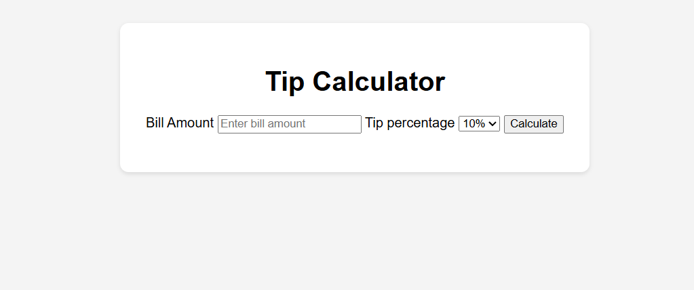

# 💸 Tip Calculator

A simple and intuitive web app to calculate tips based on the bill amount and tip percentage. Ideal for restaurants, cafes, or anyone wanting to quickly split bills with a tip.

## 🚀 Live Demo
👉 [Click here to try it out](https://hrveekshith.github.io/tip-calculator/)

## 🧰 Built With
- ✅ HTML
- ✅ CSS
- ✅ JavaScript

## 📸 Preview

 <!-- Add a preview.png in an assets folder if you have one -->

## ✨ Features
- Input the **bill amount**
- Choose or enter a **custom tip percentage**
- View the **calculated tip** and **total amount**
- Clean, responsive UI for all devices

## 📂 How to Use
1. Enter the total bill.
2. Select or input the desired tip %.
3. Instantly view the final amount and tip value.

## 📦 Setup Locally (Optional)
```bash
git clone https://github.com/hrveekshith/tip-calculator.git
cd tip-calculator
open index.html in browser
```

🧠 Learning Purpose
This project is part of my web development learning journey and helps strengthen DOM manipulation skills using vanilla JavaScript.


📜 License
This project is open source and available under the MIT License.

👤 Created by @hrveekshith


